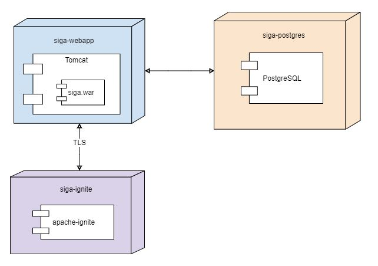

# SiGa - Signature Gateway

Signature Gateway is a web service for creating, signing and validating ASIC-E and BDOC containers with XAdES signatures.

## External services used by SiGa

* [Signature Validation Service](http://open-eid.github.io/SiVa/) for validating signatures.
* [MID REST service](https://github.com/SK-EID/MID/wiki) for signing with Mobile-ID (if enabled in configuration).
* [Smart-ID service](https://github.com/SK-EID/smart-id-documentation) for signing with Smart-ID (if enabled in configuration).
* TimeStamping service (based on configuration)
* (AIA) OCSP service (based on configuration)
* LOTL and national TSL services

### SiGa component model


## How to build

### Using Maven Wrapper

Recommended way of building this project is using [Maven Wrapper](https://github.com/takari/maven-wrapper) to build it.
Run the following command:

```bash
./mvnw clean install
```

## How to deploy

### SiGa Deployment digagram



SiGa project compiles into a WAR (Web application archive) file and requires a servlet container to run.

Additionally [Apache Ignite](https://ignite.apache.org/) version 2.8.1 is required for session management. **Ignite servers must be up and running prior SiGa startup.**
Ignite servers must be configured the same way as the Ignite client embedded in SiGa. An example Ignite configuration file can be seen [here](siga-webapp/src/main/resources/ignite/ignite-configuration.xml).

### Running SiGa in Tomcat

First Tomcat web servlet container needs to be downloaded. For example, when using the latest 8.5 version, which at the time of writing was 8.5.46, could be downloaded with `wget`:

```bash
wget https://www-eu.apache.org/dist/tomcat/tomcat-8/v8.5.46/bin/apache-tomcat-8.5.46.tar.gz
```

Unpack it somewhere:

```bash
tar -xzf apache-tomcat-8.5.46.tar.gz
```

Copy the built WAR file into Tomcat `webapps` directory and start the servlet container:

```bash
cp SiGa/siga-webapp/target/siga-webapp-2.0.1.war apache-tomcat-8.5.46/webapps
./apache-tomcat-8.5.46/bin/catalina.sh run
```

### Configuring SiGa in Tomcat

* Make [`application.properties`](#applicationproperties) available anywhere in the host system.
* Create or modify `setenv.sh` placed inside Tomcat `bin` directory:
  * `export JAVA_OPTS="$JAVA_OPTS -Dspring.config.location=file:/path/to/application.properties"`
  * `export JAVA_OPTS="$JAVA_OPTS -Dspring.profiles.active=list-of-profiles-to-activate"` (see [available profiles](#available-profiles))

Additionally, when running SiGa on a Java version greater than 8, the following parameters should be added to `JAVA_OPTS` (see more on [Ignite Getting Started guide](https://apacheignite.readme.io/docs/getting-started#section-running-ignite-with-java-9-10-11)):

```bash
--add-exports=java.base/jdk.internal.misc=ALL-UNNAMED
--add-exports=java.base/sun.nio.ch=ALL-UNNAMED
--add-exports=java.management/com.sun.jmx.mbeanserver=ALL-UNNAMED
--add-exports=jdk.internal.jvmstat/sun.jvmstat.monitor=ALL-UNNAMED
--add-exports=java.base/sun.reflect.generics.reflectiveObjects=ALL-UNNAMED
--illegal-access=permit
-Djdk.tls.client.protocols=TLSv1.2
```

**NB:** when providing your own external `application.properties` file, logback configuration and so on, be sure to remove them from `siga-webapp/src/main/resources` folder before building SiGa!

#### Available profiles

| Profile name       | Description                                             |
| ------------------ | ------------------------------------------------------- |
| digidoc4jProd      | Use DD4J production mode                                |
| digidoc4jTest      | Use DD4J test mode (prefer AIA-OCSP)                    |
| digidoc4jPerf      | Use DD4J test mode (without AIA-OCSP)                   |
| mobileId           | Enable endpoints for signing with Mobile-ID             |
| smartId            | Enable endpoints for signing with Smart-ID             |
| datafileContainer  | Enable datafile container endpoints*                   |

**NB:** exactly one of `digidoc4jProd`, `digidoc4jTest` and `digidoc4jPerf` must be active!

\* Datafile containers support has not been thoroughly performance tested. Use at your own risk.

## SiGa configuration

### `application.properties`

Example `application.properties` file with DEMO parameters can be seen [here](siga-webapp/src/main/resources/application.properties).
`application.properties` values must be changed for production mode.
Common Spring Boot properties are described [here](https://docs.spring.io/spring-boot/docs/2.1.4.RELEASE/reference/html/common-application-properties.html).

#### SiGa Ignite configuration

| Parameter                              | Mandatory | Description                                 | Example                              |
| -------------------------------------- | --------- | ------------------------------------------- | ------------------------------------ |
| siga.ignite.configuration-location     | Y         | Location of the ignite configuration file.  | `/path/to/ignite-configuration.xml`  |
| siga.ignite.application-cache-version  | Y         | Version of Ignite cache.                    | `v1`                                 |

Example `ignite-configuration.xml` file can be seen [here](siga-webapp/src/main/resources/ignite/ignite-configuration.xml).

#### SiGa DD4J configuration

| Parameter                         | Mandatory | Description                                                           | Example                    |
| --------------------------------- | --------- | --------------------------------------------------------------------- | -------------------------- |
| siga.dd4j.configuration-location  | Y         | Location of the DD4J configuration file.                              | `/path/to/digidoc4j.yaml`  |
| siga.dd4j.tsl-refresh-job-cron    | Y         | Cron expression for the scheduled job that refreshes DD4J TSL cache.  | `0 0 3 * * *`              |

Example `digidoc4j.yaml` file can be seen [here](siga-webapp/src/main/resources/digidoc4j.yaml).
More about configuring DD4J [here](https://github.com/open-eid/digidoc4j/wiki/Questions-&-Answers#using-a-yaml-file-for-configuration).

#### SiGa SiVa configuration

| Parameter      | Mandatory | Description                        | Example                             |
| -------------- | --------- | ---------------------------------- | ----------------------------------- |
| siga.siva.url  | Y         | Signature validation service URL.  | `https://siva-arendus.eesti.ee/V3`  |

#### SiGa MID REST configuration

Applicable if `mobileId` profile is active.

| Parameter                        | Mandatory | Description                           | Example                           |
| -------------------------------- | --------- | ------------------------------------- | --------------------------------- |
| siga.midrest.url                 | Y         | MID REST service URL.                 | `https://tsp.demo.sk.ee/mid-api`  |
| siga.midrest.allowed-countries   | N         | MID REST allowed countries.           | `EE, LT`                          |
| siga.midrest.truststore-path     | Y         | MID REST PKCS12 truststore path       | `mid_truststore.p12`              |
| siga.midrest.truststore-password | Y         | MID REST PKCS12 truststore password   | `changeIt`                          |


**NB:** MID REST relying party name and UUID are registered per [service](#siga_service).

#### SiGa Smart-ID configuration

Applicable if `smartId` profile is active.

| Parameter                                           | Mandatory | Description                                                                                                                                                                       | Example                                   |
| --------------------------------------------------- | --------- | --------------------------------------------------------------------------------------------------------------------------------------------------------------------------------- | ----------------------------------------- |
| siga.sid.url                                        | Y         | Smart-ID service URL.                                                                                                                                                             | `https://sid.demo.sk.ee/smart-id-rp/v2/`  |
| siga.sid.session-status-response-socket-open-time   | N         | Smart-ID [session status request](https://github.com/SK-EID/smart-id-documentation/blob/master/README.md#46-session-status) long poll value in milliseconds. Defaults to `1000`.  | `40`                                      |
| siga.sid.allowed-countries                          | N         | Smart-ID allowed countries. Defaults to `EE, LT, LV`.                                                                                                                             | `EE, LV, LT`                              |
| siga.sid.interaction-type                           | N         | Smart-ID [interaction](https://github.com/SK-EID/smart-id-documentation#31-uc-x-interaction-choice-realization) to be requested to be performed by the Smart-ID app. Supported options: `DISPLAY_TEXT_AND_PIN`, `VERIFICATION_CODE_CHOICE`. Defaults to `DISPLAY_TEXT_AND_PIN`.  | `VERIFICATION_CODE_CHOICE`  |
| siga.sid.truststore-path                            | Y         | Smart-ID PKCS12 truststore path                                                                                                                                                   | `sid_truststore.p12`                      |
| siga.sid.truststore-password                        | Y         | Smart-ID PKCS12 truststore password                                                                                                                                               | `changeIt`                                |

**NB:** Smart-ID relying party name and UUID are registered per [service](#siga_service).

#### SiGa security configuration

| Parameter                                            | Mandatory | Description                                                                                                                                                                                | Example                                         |
| ---------------------------------------------------- | --------- | ------------------------------------------------------------------------------------------------------------------------------------------------------------------------------------------ | ----------------------------------------------- |
| siga.security.hmac.expiration                        | Y         | Maximum amount of time from signing timestamp after which the request is considered expired, in seconds. Validation takes into account clock skew. Must be greater than or equal to `-1`.  | `5`                                             |
| siga.security.hmac.clock-skew                        | Y         | Maximum clock skew between SiGa server and service provider machines, in seconds. Must be greater than or equal to `0`.                                                                    | `2`                                             |
| siga.security.jasypt.encryption-algo                 | Y         | Algorithm that is used to encrypt service signing key values in service database.                                                                                                          | `PBEWITHSHA-256AND256BITAES-CBC-BC`             |
| siga.security.jasypt.encryption-key                  | Y         | Secret key that is used to encrypt/decrypt service signing key values in service database.                                                                                                 | `encryptorKey`                                  |
| siga.security.prohibited-policies-for-remote-signing | N         | Prohibited certificate policy OIDs for remote signing endpoint. Default values: 1.3.6.1.4.1.10015.1.3, 1.3.6.1.4.1.10015.18.1, 1.3.6.1.4.1.10015.17.2, 1.3.6.1.4.1.10015.17.1              | `1.3.6.1.4.1.10015.1.3, 1.3.6.1.4.1.10015.17.2` |

#### SiGa database configuration

Example changelogs and changesets are provided under `siga-auth/src/main/resources/db`. To apply a changelog to the database on the application startup, `spring.liquibase.change-log` property must be set, e.g.:

```
spring.liquibase.change-log=classpath:db/changelog/db.changelog-master.yaml
```

Use `classpath:db/changelog/db.changelog-master-dev.yaml` only for test/dev purposes. This changeset inserts default testing values into services database.

Out-of-the-box, SiGa supports **H2** and **PostgreSQL** databases. **H2** (which is also configured by default in the example configuration) is good for development and testing, but in production using **PostgreSQL** is recommended.
An example for configuring SiGa to use PostgreSQL:

```
spring.datasource.continue-on-error=false
spring.datasource.platform=postgresql
spring.datasource.driver-class-name=org.postgresql.Driver
spring.datasource.url=jdbc:postgresql://127.0.0.1:5432/database
spring.datasource.username=user
spring.datasource.password=password
```

#### SiGa health and heartbeat configuration

SiGa has built-in health endpoint for an overview of system related service statuses. The endpoint can be reached at `{host}/actuator/health`. An example configuration for health endpoint:
```
management.endpoint.health.show-details=ALWAYS
management.health.defaults.enabled=false
management.health.db.enabled=true
```
To add a heartbeat endpoint, the following configuration should be added to `configuration.properties`:

`management.endpoints.web.exposure.include=heartbeat,health`

The heartbeat endpoint can be accessed at `{host}/actuator/heartbeat`.

## SiGa database

### Data model

#### SIGA_CLIENT

A table holding all the registered clients that are allowed to use SiGa.

| Column name    | Type                                | Description                 |
| -------------- | ----------------------------------- | --------------------------- |
| id             | SERIAL (autoincrement primary key)  | Entry ID                    |
| name           | VARCHAR(100)                        | Client name                 |
| contact_name   | VARCHAR(100)                        | Client contact person name  |
| contact_email  | VARCHAR(256)                        | Client contact e-mail       |
| contact_phone  | VARCHAR(30)                         | Client contact phone        |
| uuid           | VARCHAR(36)                         | Client UUID                 |
| created_at     | TIMESTAMP                           | Client creation date        |
| updated_at     | TIMESTAMP                           | Client update date          |

#### SIGA_SERVICE

A table holding all the registered services that are allowed to use SiGa.

| Column name                  | Type                                | Description                                                                                                   |
| ---------------------------- | ----------------------------------- | ------------------------------------------------------------------------------------------------------------- |
| id                           | SERIAL (autoincrement primary key)  | Entry ID                                                                                                      |
| uuid                         | VARCHAR(36)                         | Service UUID                                                                                                  |
| signing_secret               | VARCHAR(128)                        | A previously agreed secret that is used to sign all requests sent to SiGa by this service                     |
| client_id                    | INTEGER                             | Client ID (foreign key to SIGA_CLIENT)                                                                        |
| name                         | VARCHAR(100)                        | Service name                                                                                                  |
| sk_relying_party_name        | VARCHAR(100)                        | [MID REST relying party name](https://github.com/SK-EID/MID#21-relyingpartyname)                              |
| sk_relying_party_uuid        | VARCHAR(100)                        | [MID REST relying party UUID](https://github.com/SK-EID/MID#22-relyingpartyuuid)                              |
| smart_id_relying_party_name  | VARCHAR(100)                        | [Smart-ID relying party name](https://github.com/SK-EID/smart-id-documentation#32-relyingpartyname-handling)  |
| smart_id_relying_party_uuid  | VARCHAR(100)                        | [Smart-ID relying party UUID](https://github.com/SK-EID/smart-id-documentation#31-uuid-encoding)              |
| billing_email                | VARCHAR(128)                        | (currently not used by SiGa)                                                                                  |
| max_connection_count         | INTEGER                             | Allowed maximum number of active sessions for this service. A value of `-1` indicates no limit                |
| max_connections_size         | BIGINT                              | Allowed cumulative maximum data volume* for all active sessions. A value of `-1` indicates no limit           |
| max_connection_size          | BIGINT                              | Allowed maximum data volume* for a single session. A value of `-1` indicates no limit                         |
| inactive                     | BOOLEAN                             | Indicates if the service is active or not                                                                     |
| created_at                   | TIMESTAMP                           | Service creation date                                                                                         |
| updated_at                   | TIMESTAMP                           | Service update date                                                                                           |

\* data volume is based on the content length of HTTP POST requests.

#### SIGA_CONNECTION

A table holding cumulative data volume* per active session.

| Column name   | Type                                | Description                                                                  |
| ------------- | ----------------------------------- | ---------------------------------------------------------------------------- |
| id            | SERIAL (autoincrement primary key)  | Entry ID                                                                     |
| container_id  | VARCHAR(36)                         | Container ID (an internal identifier identifying a currently active session) |
| service_id    | INTEGER                             | Service ID (foreign key to SIGA_SERVICE)                                     |
| size          | BIGINT                              | Cumulative data volume* for this session                                     |
| created_at    | TIMESTAMP                           | Connection creation date                                                     |
| updated_at    | TIMESTAMP                           | Connection update date                                                       |

\* data volume is based on the content length of HTTP POST requests.

#### SIGA_IP_PERMISSION

A table holding ip permissions for external Siga service (SOAP PROXY)

| Column name   | Type                                | Description                                           |
| ------------- | ----------------------------------- | ----------------------------------------------------- |
| id            | SERIAL (autoincrement primary key)  | Entry ID                                              |
| service_id    | INTEGER                             | Service ID (foreign key to SIGA_SERVICE)              |
| ip_address    | VARCHAR(36)                         | Allowed ip address                                    |
| created_at    | TIMESTAMP                           | Ip permission creation date                           |
| updated_at    | TIMESTAMP                           | Ip permission update date                             |

### Running SiGa with Docker

For development and testing purposes only!

Docker must be installed and running.

First time  setup: 

* build this project

```bash
./mvnw clean install
```

* From your project directory, start up your applications in test mode by running

```bash
docker-compose up
```

Then, open siga-sample-application
`
https://localhost:8444/
`

SiGa itself is accessible 
`
https://localhost:8443/siga
`

For updating software:

* Build the project with changes

```bash
./mvnw clean install
```

* Update docker image

```bash
docker-compose build
```

* Run the image

```bash
docker-compose up
```