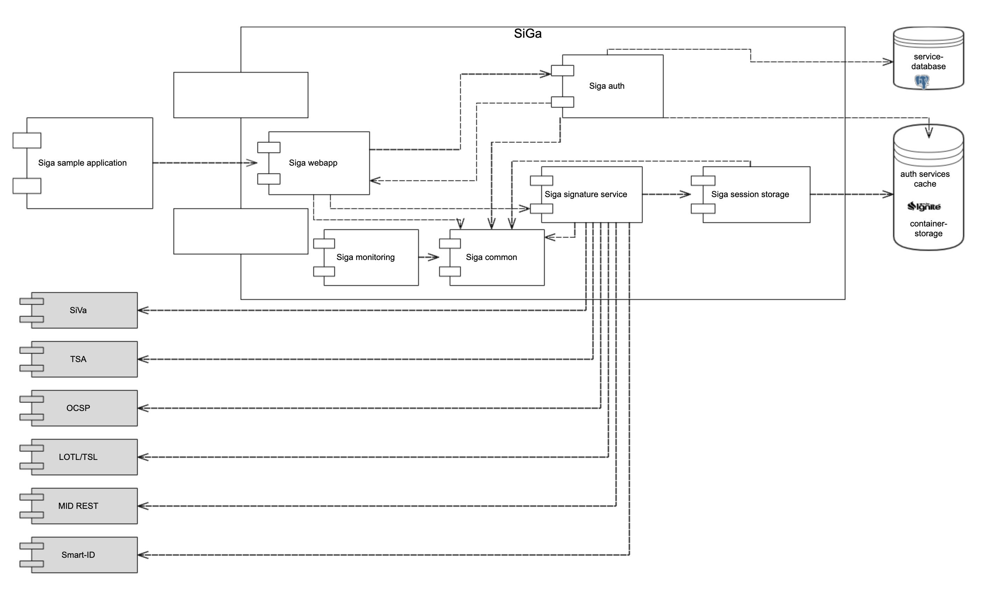
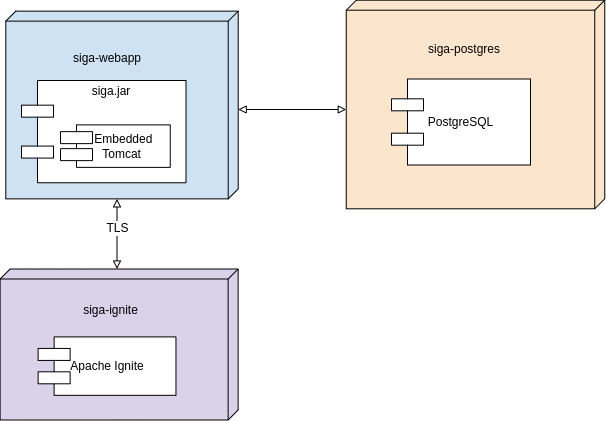

# SiGa - Signature Gateway

Signature Gateway is a web service for creating and signing ASIC-E containers and validating both ASIC-E and BDOC containers with XAdES signatures.

> [!NOTE]
> Looking for the [**Digital Signature Gateway service**](https://www.ria.ee/en/state-information-system/electronic-identity-eid-and-trust-services/services-digital-signatures)?  
> Documentation is available [**here**](https://open-eid.github.io/allkirjastamisteenus/).

## Prerequisites:
For building and running SiGa you need Java 17.

## External services used by SiGa

* [Signature Validation Service](http://open-eid.github.io/SiVa/) for validating signatures.
* [MID REST service](https://github.com/SK-EID/MID/wiki) for signing with Mobile-ID (if enabled in configuration).
* [Smart-ID service](https://github.com/SK-EID/smart-id-documentation) for signing with Smart-ID (if enabled in configuration).
* TimeStamping service (based on configuration)
* (AIA) OCSP service (based on configuration)
* LOTL and national TSL services

### SiGa component model



## How to build

SiGa project compiles into a JAR (Java archive) or WAR (Web application archive) file. The former one includes embedded
Tomcat, while the latter one requires a separate servlet container to run.

### Building JAR with embedded Tomcat

```bash
./mvnw clean install
```

### Building WAR for a separate servlet container

```bash
./mvnw clean install -Pwar
```

### Running tests against the Ignite session-storage backend

The unit test suite runs against the Redis/Valkey backend by default. Activate the
`ignite-tests` Maven profile to run the same suite against the Apache Ignite backend:

```bash
./mvnw clean install -Pignite-tests
```

Combine with `-Pwar` if a WAR artifact is also required (`-Pwar,ignite-tests`).

## How to deploy

### SiGa Deployment diagram



In addition to a JAR or WAR file containing compiled SiGa, a session-storage backend is required.
SiGa ships with two backends, selected via `siga.session-storage.type`:

* **Redis/Valkey** (`siga.session-storage.type=redis`, the default) — any Redis-OSS-compatible server,
  standalone or cluster. Tested against Valkey 7.2. See [Running Redis/Valkey](#running-redisvalkey-default)
  below.
* **Apache Ignite** (`siga.session-storage.type=ignite`) — [Apache Ignite](https://ignite.apache.org/)
  version 2.17.0, kept for backwards compatibility. See [Running Apache Ignite](#running-apache-ignite-opt-in).

### Running the session-storage backend

#### Running Redis/Valkey (default)

A Redis-OSS-compatible server (Redis 7.x or Valkey 7.2+) must be reachable from every SiGa node
before startup. Cluster and standalone topologies are both supported; cluster mode is recommended
for production.

Two Redis server settings are mandatory for SiGa:

* `notify-keyspace-events` must include `E` and `x` (e.g. `Ex`). `RedisSessionExpiryNotifier`
  subscribes to `__keyevent@*__:expired` at startup and fails fast if the flag set is missing
  those bits — without them container expiry cleanup silently breaks.
* `maxmemory-policy` should be `volatile-lru`. The policy evicts only keys that have a TTL
  set; keys without a TTL are immune to eviction. The operational
  `siga:{reprocess}:signature` and `siga:{reprocess}:certificate` ZSETs are written without a
  TTL and so are never evicted, while TTL'd keys (`siga:session:*`, `siga:lock:*`, AUTH_SERVICES
  cache) remain eviction candidates.

Point SiGa at the cluster by setting the seed nodes in `application.properties`:

```
siga.session-storage.type=redis
spring.data.redis.cluster.nodes=redis-1.example:6379,redis-2.example:6380,redis-3.example:6381
```

On managed Valkey/Redis (AWS ElastiCache, MemoryDB) the `CONFIG` command is blocked at the engine
layer; set `siga.session-storage.redis.skip-keyspace-events-verification=true` and ensure
`notify-keyspace-events=Ex` is configured via the parameter group. The Ignite-specific JVM
`--add-opens` flags described below are **not** required for the Redis backend. See
[Securing the Redis/Valkey client connection](#securing-the-redisvalkey-client-connection) for TLS, ACL,
and SSL-bundle setup.

#### Running Apache Ignite (opt-in)

Set `siga.session-storage.type=ignite` to use the Ignite backend.
**Ignite servers must be up and running prior to SiGa startup.** Ignite servers must be
configured the same way as the Ignite client embedded in SiGa. An example Ignite configuration file can be seen
[here](docker/siga-ignite/ignite-configuration.xml).
Additionally, the following options must be added to the `JVM_OPTS` parameter in Ignite's `setenv.sh` file:
```bash
--add-opens=jdk.management/com.sun.management.internal=ALL-UNNAMED
--add-opens=java.base/jdk.internal.misc=ALL-UNNAMED
--add-opens=java.base/sun.nio.ch=ALL-UNNAMED
--add-opens=java.management/com.sun.jmx.mbeanserver=ALL-UNNAMED
--add-opens=java.base/sun.reflect.generics.reflectiveObjects=ALL-UNNAMED
--add-opens=java.base/java.io=ALL-UNNAMED
--add-opens=java.base/java.nio=ALL-UNNAMED
--add-opens=java.base/java.util=ALL-UNNAMED
--add-opens=java.base/java.util.concurrent=ALL-UNNAMED
--add-opens=java.base/java.util.concurrent.atomic=ALL-UNNAMED
--add-opens=java.base/java.util.concurrent.locks=ALL-UNNAMED
--add-opens=java.base/java.lang=ALL-UNNAMED
--add-opens=java.base/java.time=ALL-UNNAMED
```
For general instructions, refer to [the official documentation](https://ignite.apache.org/docs/latest/quick-start/java) to
configure and run Ignite.

### Running SiGa

#### Running SiGa with embedded Tomcat

* Make [`application.properties`](#applicationproperties) available anywhere in the host system.
* Set $JAVA_OPTS environment variable with the required options. When the Ignite backend is
  active, the `--add-opens` flags below are required (see more on
  [Ignite Getting Started guide](https://ignite.apache.org/docs/latest/quick-start/java#running-ignite-with-java-11-or-later));
  with the default Redis backend they can be omitted.
  Replace the path of `application.properties` in the following command to point to your own file.
  ```bash
  export JAVA_OPTS="-Dspring.config.location=file:/path/to/application.properties\
    --add-opens=jdk.management/com.sun.management.internal=ALL-UNNAMED\
    --add-opens=java.base/jdk.internal.misc=ALL-UNNAMED\
    --add-opens=java.base/sun.nio.ch=ALL-UNNAMED\
    --add-opens=java.management/com.sun.jmx.mbeanserver=ALL-UNNAMED\
    --add-opens=java.base/sun.reflect.generics.reflectiveObjects=ALL-UNNAMED\
    --add-opens=java.base/java.io=ALL-UNNAMED\
    --add-opens=java.base/java.nio=ALL-UNNAMED\
    --add-opens=java.base/java.util=ALL-UNNAMED\
    --add-opens=java.base/java.util.concurrent=ALL-UNNAMED\
    --add-opens=java.base/java.util.concurrent.atomic=ALL-UNNAMED\
    --add-opens=java.base/java.util.concurrent.locks=ALL-UNNAMED\
    --add-opens=java.base/java.lang=ALL-UNNAMED\
    --add-opens=java.base/java.time=ALL-UNNAMED\
    --add-opens=java.base/sun.security.x509=ALL-UNNAMED\
    --add-opens=java.base/java.security.cert=ALL-UNNAMED\
    -Djdk.tls.client.protocols=TLSv1.2"
  ```
* Run JAR file with SiGa webapp and embedded Tomcat (X.X.X denotes the version you are using):
  ```bash
  java $JAVA_OPTS -jar siga-webapp/target/siga-webapp-X.X.X.jar
  ```

#### Running SiGa in separate Tomcat installation

At first, Tomcat web servlet container needs to be downloaded. For example, version 8.5.46 could be downloaded with the
following command using `wget`:
```bash
wget https://www-eu.apache.org/dist/tomcat/tomcat-8/v8.5.46/bin/apache-tomcat-8.5.46.tar.gz
```

Unpack it somewhere:
```bash
tar -xzf apache-tomcat-8.5.46.tar.gz
```

Copy the built WAR file containing SiGa into Tomcat's `webapps` directory and start the servlet container:
```bash
cp SiGa/siga-webapp/target/siga-webapp-2.0.1.war apache-tomcat-8.5.46/webapps
./apache-tomcat-8.5.46/bin/catalina.sh run
```

* Make [`application.properties`](#applicationproperties) available anywhere in the host system.
* Depending on your system, it might be required to set the `JAVA_HOME` environment variable in file `/etc/default/tomcat8`. For example:
  * `JAVA_HOME=/usr/lib/jvm/java-17-openjdk-amd64`
* Create or modify `setenv.sh` placed inside Tomcat `bin` directory:
  * `export JAVA_OPTS="$JAVA_OPTS -Dspring.config.location=file:/path/to/application.properties"`
  * `export JAVA_OPTS="$JAVA_OPTS -Dspring.profiles.active=list-of-profiles-to-activate"` (see [available profiles](#available-profiles))

When the Ignite backend is active, the following options must additionally be added to the `JAVA_OPTS`
parameter in the same `setenv.sh` file (see more on
[Ignite Getting Started guide](https://ignite.apache.org/docs/latest/quick-start/java#running-ignite-with-java-11-or-later));
with the default Redis backend they can be omitted:
```bash
--add-opens=jdk.management/com.sun.management.internal=ALL-UNNAMED
--add-opens=java.base/jdk.internal.misc=ALL-UNNAMED
--add-opens=java.base/sun.nio.ch=ALL-UNNAMED
--add-opens=java.management/com.sun.jmx.mbeanserver=ALL-UNNAMED
--add-opens=java.base/sun.reflect.generics.reflectiveObjects=ALL-UNNAMED
--add-opens=java.base/java.io=ALL-UNNAMED
--add-opens=java.base/java.nio=ALL-UNNAMED
--add-opens=java.base/java.util=ALL-UNNAMED
--add-opens=java.base/java.util.concurrent=ALL-UNNAMED
--add-opens=java.base/java.util.concurrent.atomic=ALL-UNNAMED
--add-opens=java.base/java.util.concurrent.locks=ALL-UNNAMED
--add-opens=java.base/java.lang=ALL-UNNAMED
--add-opens=java.base/java.time=ALL-UNNAMED
--add-opens=java.base/sun.security.x509=ALL-UNNAMED
--add-opens=java.base/java.security.cert=ALL-UNNAMED
-Djdk.tls.client.protocols=TLSv1.2
```

### Available Spring profiles

| Profile name | Description |
| --- | --- |
| digidoc4jProd | Use DD4J production mode |
| digidoc4jTest | Use DD4J test mode (prefer AIA-OCSP) |
| digidoc4jPerf | Use DD4J test mode (without AIA-OCSP) |
| mobileId | Enable endpoints for signing with Mobile-ID |
| smartId | Enable endpoints for signing with Smart-ID |
| datafileContainer | Enable datafile container endpoints* |

**NB:** exactly one of `digidoc4jProd`, `digidoc4jTest` and `digidoc4jPerf` must be active!

\* Datafile containers support has not been thoroughly performance tested. Use at your own risk.

## SiGa configuration

### `application.properties`

Example `application.properties` file with DEMO parameters can be seen [here](docker/siga-webapp/application.properties).
`application.properties` values must be changed for production mode, as default maven profile does not include it in the build.
Common Spring Boot properties are described [here](https://docs.spring.io/spring-boot/docs/2.7.7/reference/html/application-properties.html).

#### SiGa session-storage configuration

SiGa supports two interchangeable session-storage backends, selected via `siga.session-storage.type`.
The Redis/Valkey backend is the default and works with both standalone and cluster topologies; the
Apache Ignite backend remains supported for operators who cannot move off Ignite yet.

Backend-agnostic parameters:

| Parameter | Mandatory | Description | Example |
| --- | --- | --- | --- |
| siga.session-storage.type | N | Session-storage backend selector: `redis` (default) or `ignite`. May be overridden via env var `SIGA_SESSION_STORAGE_TYPE`. | `redis` |
| siga.session-storage.application-cache-version | Y | Cache namespace version tag. Bumping it invalidates the cached session data across rolling upgrades. | `v1` |

Redis backend parameters (applicable when `siga.session-storage.type=redis`):

| Parameter | Mandatory | Description | Example |
| --- | --- | --- | --- |
| siga.session-storage.redis.session-ttl | N | TTL applied to `siga:session:*` serialized session value keys. Defaults to `PT5M`. [Supports ISO 8601 Duration format.](https://docs.spring.io/spring-boot/docs/current/reference/html/spring-boot-features.html#boot-features-external-config-conversion-duration) | `PT5M` |
| siga.session-storage.redis.lock-ttl | N | Lease duration for distributed locks issued via `SessionLockRegistry`. Bounds failover recovery after a holder crashes. Defaults to `PT2M`. Do not approach `session-ttl` or stale locks may outlive the session itself. | `PT2M` |
| siga.session-storage.redis.status-scan-batch-size | N | Per-tick cap on the number of sessionIds the status scanner pulls from each `siga:{reprocess}:*` due queue via `ZRANGEBYSCORE … LIMIT`. Defaults to `100`. | `100` |
| siga.session-storage.redis.lock-renewal-thread-pool-size | N | Pool size for the scheduler that renews active distributed-lock leases. Every live lock schedules a renewal at `lock-ttl/3`; the pool must be wide enough that one slow Redis call doesn't head-of-line-block renewals for unrelated locks. Defaults to `32`. | `32` |
| siga.session-storage.redis.skip-keyspace-events-verification | N | When `true`, skip the startup `CONFIG GET notify-keyspace-events` probe in `RedisSessionExpiryNotifier`. Required on managed Valkey/Redis (e.g. AWS ElastiCache, MemoryDB) where `CONFIG` is blocked at the engine layer; operators must then ensure `notify-keyspace-events=Ex` via the parameter group. Defaults to `false`. | `false` |

On the Ignite backend, the equivalent TTLs (`CONTAINER_SESSION`, `SIGNATURE_SESSION`,
`CERTIFICATE_SESSION`) are configured per-cache in `ignite-configuration.xml` via
`expiryPolicyFactory`; see the Ignite backend parameters below for the mapping.

Ignite backend parameters (applicable when `siga.session-storage.type=ignite`):

| Parameter | Mandatory | Description | Example |
| --- | --- | --- | --- |
| siga.session-storage.ignite.configuration-location | Y | Location of the Ignite XML configuration file. Only consulted when `siga.session-storage.type=ignite`. | `/path/to/ignite-configuration.xml` |

The Ignite backend has no per-cache Spring properties. Cache-level settings — including TTLs
for the session caches and the `AUTH_SERVICES` cache — live inside the Ignite XML, on each
cache's `expiryPolicyFactory`. The example file ships them at 300s each. These knobs map to
Spring properties on the Redis backend as follows:

| Ignite cache (XML `expiryPolicyFactory`) | Redis backend equivalent |
| --- | --- |
| `CONTAINER_SESSION`, `SIGNATURE_SESSION`, `CERTIFICATE_SESSION` | `siga.session-storage.redis.session-ttl` (covers all three) |
| `AUTH_SERVICES` | `siga.auth.cache.services-ttl` |

Example `ignite-configuration.xml` file can be seen [here](docker/siga-ignite/ignite-configuration.xml).

#### Spring Data Redis configuration

SiGa connects to Redis/Valkey through Spring Data Redis (Lettuce). The following Spring Boot
stock properties are honoured; canonical descriptions live in the
[Spring Boot application properties reference](https://docs.spring.io/spring-boot/docs/current/reference/html/application-properties.html#application-properties.data.spring.data.redis).

| Parameter | Mandatory | Description | Example |
| --- | --- | --- | --- |
| spring.data.redis.cluster.nodes | Y (cluster) | Comma-separated seed list (`host:port,…`) for Redis Cluster. Three seeds are enough — Lettuce learns the full topology from any one of them. | `redis-1:6379,redis-2:6380,redis-3:6381` |
| spring.data.redis.cluster.max-redirects | N | Maximum number of `MOVED`/`ASK` redirects Lettuce follows per command before failing. `3` is a sensible production default; the Spring Boot default is `5`. | `3` |
| spring.data.redis.host / spring.data.redis.port | Y (standalone) | Standalone alternative to `cluster.nodes`. `cluster.nodes` takes precedence when both are set. | `redis.example.com` / `6379` |
| spring.data.redis.timeout | N | Command timeout (ISO-8601 duration). Raise for higher-latency environments (cross-AZ, managed Redis behind a proxy). | `2s` |
| spring.data.redis.lettuce.cluster.refresh.period | N | Periodic topology-refresh interval. Recommended `30s` to recover from managed-Valkey failovers (ElastiCache primary promotion, AZ replacement). No-op in standalone deployments. | `30s` |
| spring.data.redis.lettuce.cluster.refresh.adaptive | N | When `true`, refresh topology on adaptive triggers (`MOVED`, `ASK`, `PERSISTENT_RECONNECTS`, …). Recommended `true` on managed Valkey. | `true` |
| spring.data.redis.lettuce.cluster.refresh.dynamic-refresh-sources | N | When `true`, re-read the seed list from every reachable cluster node, not just the configured seeds. | `true` |
| spring.data.redis.username | N | Redis ACL username. Production deployments should use a dedicated, non-`default` user. | `siga` |
| spring.data.redis.password | N | Redis ACL password / AUTH token. | `changeit` |
| spring.data.redis.ssl.enabled | N | TLS toggle. Should be `true` on any non-loopback production target. Defaults to `false`. | `true` |
| spring.data.redis.ssl.bundle | N | Name of a Spring Boot SSL bundle (declared under `spring.ssl.bundle.*`) used to trust the server certificate. Only needed when the server cert chain is not in the JVM default truststore. See [Securing the Redis/Valkey client connection](#securing-the-redisvalkey-client-connection) below. | `redis` |
| spring.data.redis.lettuce.pool.max-active | N | Maximum Lettuce connections. Lettuce multiplexes a single connection by default — sufficient for SiGa's non-blocking command mix. Set only with profiling evidence of contention. | `16` |
| spring.data.redis.lettuce.pool.max-idle | N | Maximum idle Lettuce connections. See the note on `max-active` above. | `8` |

##### Securing the Redis/Valkey client connection

Production deployments must authenticate the client and encrypt the connection. The Redis/Valkey
client is configured through stock Spring Boot properties — no SiGa-specific code or beans are
involved — but the three pieces (ACL, TLS, server trust) need to be set together.

**ACL (RBAC).** Bind SiGa to a dedicated, non-`default` ACL user. The server admin provisions
the user with a strong password and grants the commands SiGa issues on the normal data path:
`GET`, `SET`, `DEL`, `EXPIRE`, `PEXPIRE`, `EXISTS`, `SCAN`, `HSET`, `HGET`, `HMGET`, `HDEL`, `ZADD`,
`ZRANGEBYSCORE`, `ZREM`, `PUBLISH`, `SUBSCRIBE`, `PSUBSCRIBE`, `EVAL`, `EVALSHA`,
`SCRIPT`, and `CLUSTER`. With the default startup keyspace-events verification enabled,
also allow `CONFIG GET notify-keyspace-events` (the `CONFIG` command, restricted to `GET`
where the server supports subcommand ACLs) so `RedisSessionExpiryNotifier` can fail fast on
missing expiry notifications. Managed Redis/Valkey services often block `CONFIG`; in those
deployments set `siga.session-storage.redis.skip-keyspace-events-verification=true` and
configure `notify-keyspace-events=Ex` through the service parameter group instead.
`RedisSessionExpiryNotifier` additionally subscribes to the keyspace-notification channel
`__keyevent@*__:expired`, which requires `PSUBSCRIBE` on that channel pattern. Wire the
credentials through `spring.data.redis.username` and `spring.data.redis.password`, ideally
as environment-injected placeholders rather than plain-text values committed to
`application.properties`.

**TLS in transit.** Set `spring.data.redis.ssl.enabled=true`. Lettuce enables SNI and peer
certificate verification by default — leave both on. Cluster-mode topology refresh, pub/sub for
expiry notifications, and `RedisLockRegistry` all continue to work transparently over TLS.

**Trusting the server certificate.** If the Redis/Valkey server presents a certificate chained
to a CA already in the JVM default truststore (`$JAVA_HOME/lib/security/cacerts`), no further
configuration is needed. Otherwise declare a Spring Boot SSL bundle and reference it via
`spring.data.redis.ssl.bundle`. The bundle name (`redis` in the examples below) is arbitrary
but must match on both sides; the same bundle can be reused by any other Spring component that
accepts an `ssl.bundle` reference.

PEM truststore — a single CA cert or a concatenated bundle file:
```properties
spring.ssl.bundle.pem.redis.truststore.certificate=file:/etc/siga/redis-ca.pem
spring.data.redis.ssl.bundle=redis
```

JKS or PKCS12 truststore:
```properties
spring.ssl.bundle.jks.redis.truststore.location=file:/etc/siga/redis-truststore.p12
spring.ssl.bundle.jks.redis.truststore.password=changeit
spring.data.redis.ssl.bundle=redis
```

Putting it all together, a production properties block looks like:
```properties
spring.data.redis.cluster.nodes=redis-1.example:6379,redis-2.example:6379,redis-3.example:6379
spring.data.redis.cluster.max-redirects=3
spring.data.redis.lettuce.cluster.refresh.period=30s
spring.data.redis.lettuce.cluster.refresh.adaptive=true
spring.data.redis.lettuce.cluster.refresh.dynamic-refresh-sources=true
spring.data.redis.username=${REDIS_USERNAME}
spring.data.redis.password=${REDIS_PASSWORD}
spring.data.redis.ssl.enabled=true
spring.data.redis.ssl.bundle=redis
spring.ssl.bundle.pem.redis.truststore.certificate=file:/etc/siga/redis-ca.pem
```

#### SiGa auth-services cache configuration

When the Redis backend is active (`siga.session-storage.type=redis`), the `AUTH_SERVICES`
cache that backs service-credentials lookups is backed by Spring's `RedisCacheManager` and
its TTL is driven by `siga.auth.cache.services-ttl` (below). On the Ignite backend, the same
`AUTH_SERVICES` cache and its TTL are defined in `ignite-configuration.xml` via that cache's
`expiryPolicyFactory` — there is no equivalent Spring property.

| Parameter | Mandatory | Description | Example |
| --- | --- | --- | --- |
| siga.auth.cache.services-ttl | N | TTL for `AUTH_SERVICES` cache entries. Defaults to `5m`. [Supports ISO 8601 Duration format.](https://docs.spring.io/spring-boot/docs/current/reference/html/spring-boot-features.html#boot-features-external-config-conversion-duration) | `5m` |

#### SiGa DD4J configuration

| Parameter | Mandatory | Description | Example |
| --- | --- | --- | --- |
| siga.dd4j.configuration-location | Y | Location of the DD4J configuration file. | `/path/to/digidoc4j.yaml` |
| siga.dd4j.tsl-refresh-job-cron | Y | Cron expression for the scheduled job that refreshes DD4J TSL cache. | `0 0 3 * * *` |

More about configuring DD4J [here](https://github.com/open-eid/digidoc4j/wiki/Questions-&-Answers#using-a-yaml-file-for-configuration).

#### SiGa SiVa configuration

| Parameter | Mandatory | Description | Example |
| --- | --- | --- | --- |
| siga.siva.url | Y | Signature validation service URL. | `https://siva-arendus.eesti.ee/V3` |
| siga.siva.trust-store | Y | SiVa service truststore path. | `file:/path/to/trust-store.p12` or `classpath:path/to/trust-store.p12` |
| siga.siva.trust-store-password | Y | SiVa service truststore password. | `changeit` |
| siga.siva.connection-timeout | N | Connection timeout for regular connections in ISO-8601 duration format `PnDTnHnMn.nS`. The input is truncated to millisecond precision. If not provided, defaults to system default. | `PT10S` |
| siga.siva.write-timeout | N | Write timeout for regular connections in ISO-8601 duration format `PnDTnHnMn.nS`. The input is truncated to millisecond precision. If not provided, defaults to system default. | `PT10S` |
| siga.siva.read-timeout | N | Read timeout for regular connections in ISO-8601 duration format `PnDTnHnMn.nS`. The input is truncated to millisecond precision. If not provided, defaults to system default. | `PT10S` |
| siga.siva.max-in-memory-size | N | Maximum size of data to be sent to SiVa. If not provided, defaults to 256KB. Note that the default size may not be enough for containers with dozens of signatures. | `5MB` |

#### SiGa MID REST configuration

Applicable if `mobileId` profile is active.

| Parameter | Mandatory | Description | Example |
| --- | --- | --- | --- |
| siga.midrest.url | Y | MID REST service URL. | `https://tsp.demo.sk.ee/mid-api` |
| siga.midrest.allowed-countries | N | MID REST allowed countries. | `EE, LT` |
| siga.midrest.truststore-path | Y | MID REST PKCS12 truststore path. | `mid_truststore.p12` |
| siga.midrest.truststore-password | Y | MID REST PKCS12 truststore password. | `changeIt` |
| siga.midrest.long-polling-timeout | N | MID REST [session status request](https://github.com/SK-EID/MID#334-long-polling) long poll value in milliseconds. Defaults to `30000`. [Supports ISO 8601 Duration format.](https://docs.spring.io/spring-boot/docs/current/reference/html/spring-boot-features.html#boot-features-external-config-conversion-duration) | `30000` |
| siga.midrest.connect-timeout | N | MID REST client connection timeout in milliseconds. Defaults to `5000`. [Supports ISO 8601 Duration format.](https://docs.spring.io/spring-boot/docs/current/reference/html/spring-boot-features.html#boot-features-external-config-conversion-duration) | `5000` |
| siga.midrest.status-polling-delay | N | Delay before polling status in milliseconds. Defaults to `6000`. [Supports ISO 8601 Duration format.](https://docs.spring.io/spring-boot/docs/current/reference/html/spring-boot-features.html#boot-features-external-config-conversion-duration) | `6000` |

**NB:** MID REST relying party name and UUID are registered per [service](#siga_service).

#### SiGa Smart-ID configuration

Applicable if `smartId` profile is active.

| Parameter | Mandatory | Description | Example |
| --- | --- | --- | --- |
| siga.sid.url | Y | Smart-ID service URL. | `https://sid.demo.sk.ee/smart-id-rp/v2/` |
| siga.sid.session-status-response-socket-open-time | N | Smart-ID [session status request](https://github.com/SK-EID/smart-id-documentation/blob/master/README.md#46-session-status) long poll value in milliseconds. Defaults to `30000`. [Supports ISO 8601 Duration format.](https://docs.spring.io/spring-boot/docs/current/reference/html/spring-boot-features.html#boot-features-external-config-conversion-duration) | `30000` |
| siga.sid.connect-timeout | N | Smart-ID client connection timeout in milliseconds. Defaults to `5000`. [Supports ISO 8601 Duration format.](https://docs.spring.io/spring-boot/docs/current/reference/html/spring-boot-features.html#boot-features-external-config-conversion-duration) | `5000` |
| siga.sid.status-polling-delay | N | Delay before polling status in milliseconds. Defaults to `6000`. [Supports ISO 8601 Duration format.](https://docs.spring.io/spring-boot/docs/current/reference/html/spring-boot-features.html#boot-features-external-config-conversion-duration) | `6000` |
| siga.sid.allowed-countries | N | Smart-ID allowed countries. Defaults to `EE, LT, LV`. | `EE, LV, LT` |
| siga.sid.interaction-type | N | Smart-ID [interaction](https://github.com/SK-EID/smart-id-documentation#31-uc-x-interaction-choice-realization) to be requested to be performed by the Smart-ID app. Supported options: `DISPLAY_TEXT_AND_PIN`, `VERIFICATION_CODE_CHOICE`. Defaults to `DISPLAY_TEXT_AND_PIN`. | `VERIFICATION_CODE_CHOICE` |
| siga.sid.truststore-path | Y | Smart-ID PKCS12 truststore path | `sid_truststore.p12` |
| siga.sid.truststore-password | Y | Smart-ID PKCS12 truststore password | `changeIt` |

**NB:** Smart-ID relying party name and UUID are registered per [service](#siga_service).

#### SiGa MID/SID signature/certificate status request re-processing configuration

MID/SID signature/certificate status requests and signature finalization steps are performed in background process. Following configuration parameters define how these steps are re-processed if exception occurs.

| Parameter | Mandatory | Description | Example |
| --- | --- | --- | --- |
| siga.status-reprocessing.fixed-rate | N | Failed signature/certificate status re-processing interval in milliseconds. Default value in milliseconds: `5000` | `5000` |
| siga.status-reprocessing.initial-delay | N | Initial delay on startup before re-processing signature/certificate status requests. Default value in milliseconds: `5000` | `5000` |
| siga.status-reprocessing.max-processing-attempts | N | Maximum failed processing attempts. Default value: `10` | `10` |
| siga.status-reprocessing.processing-timeout | N | Maximum processing time, before request is considered failed and can be re-processed by other SiGa nodes. Used when request processing SiGa node fails or leaves the session-storage cluster topology. Default value in milliseconds: `30000` [Supports ISO 8601 Duration format.](https://docs.spring.io/spring-boot/docs/current/reference/html/spring-boot-features.html#boot-features-external-config-conversion-duration) | `30000` |
| siga.status-reprocessing.exception-timeout | N | Maximum time from last exception, before request is considered failed and can be re-processed by other SiGa nodes. Used when recoverable exception (e.g. networking) occurs and request can be re-processed. Default value in milliseconds: `5000`  [Supports ISO 8601 Duration format.](https://docs.spring.io/spring-boot/docs/current/reference/html/spring-boot-features.html#boot-features-external-config-conversion-duration) | `5000` |

#### SiGa security configuration

| Parameter | Mandatory | Description | Example |
| --- | --- | --- | --- |
| siga.security.hmac.expiration | Y | Maximum amount of time from signing timestamp after which the request is considered expired, in seconds. Validation takes into account clock skew. Must be greater than or equal to `-1`. | `5` |
| siga.security.hmac.clock-skew | Y | Maximum clock skew between SiGa server and service provider machines, in seconds. Must be greater than or equal to `0`. | `2` |
| siga.security.jasypt.encryption-algo | Y | Algorithm that is used to encrypt service signing key values in service database. | `PBEWITHSHA-256AND256BITAES-CBC-BC` |
| siga.security.jasypt.encryption-key | Y | Secret key that is used to encrypt/decrypt service signing key values in service database. | `encryptorKey` |
| siga.security.prohibited-policies-for-remote-signing | N | Prohibited certificate policy OIDs for remote signing endpoint. Default values: 1.3.6.1.4.1.10015.1.3, 1.3.6.1.4.1.10015.18.1, 1.3.6.1.4.1.10015.17.2, 1.3.6.1.4.1.10015.17.1 | `1.3.6.1.4.1.10015.1.3, 1.3.6.1.4.1.10015.17.2` |

#### SiGa database configuration

Example changelogs and changesets are provided under `siga-auth/src/main/resources/db`. To apply a changelog to the database on the application startup, `spring.liquibase.change-log` property must be set, e.g.:

```
spring.liquibase.change-log=classpath:db/changelog/db.changelog-master.yaml
```

Use `classpath:db/changelog/db.changelog-master-dev.yaml` only for test/dev purposes. This changeset inserts default testing values into services database.

Out-of-the-box, SiGa supports **H2** and **PostgreSQL** databases. **H2** is good for development and testing, but in production using **PostgreSQL** is recommended.
An example for configuring SiGa to use PostgreSQL:

```
spring.sql.init.continue-on-error=false
spring.sql.init.platform=postgresql
spring.datasource.driver-class-name=org.postgresql.Driver
spring.datasource.url=jdbc:postgresql://127.0.0.1:5432/database
spring.datasource.username=user
spring.datasource.password=password
```

#### SiGa monitoring configuration

SiGa exposes monitoring endpoints via [Spring Boot Actuator](https://docs.spring.io/spring-boot/reference/actuator/endpoints.html). An example configuration for monitoring-related properties used in the Docker-based demo setup can be found in [docker/siga-webapp/application.properties](docker/siga-webapp/application.properties). If SiGa is configured without the example configuration, [Spring Boot default values](https://docs.spring.io/spring-boot/appendix/application-properties/index.html) will apply.

`management.health.redis.enabled` enables Spring Boot's Redis health indicator and is only
meaningful when the Redis session-storage backend is active (i.e. `siga.session-storage.type=redis`,
or unset, since Redis is the default; see `RedisSessionConfiguration`). When using the Ignite
backend (`siga.session-storage.type=ignite`), set `management.health.redis.enabled=false`; otherwise
the health endpoint can report Redis as down even though Redis is not part of that deployment mode.

**Heartbeat endpoint**

The heartbeat endpoint returns a simple aggregate health status. Since it delegates to the Spring Boot [health endpoint](https://docs.spring.io/spring-boot/reference/actuator/endpoints.html#actuator.endpoints.health) internally, `health` must also be included for the heartbeat to function. The following configuration should be added to `application.properties`:
```
management.endpoints.web.exposure.include=health,heartbeat
management.endpoint.heartbeat.enabled=true
```
By default, the heartbeat endpoint can be accessed at `{host}/actuator/heartbeat`. Subject to configured servlet context path and actuator configuration.

**Version endpoint**

To add the version information endpoint, the following configuration should be added to `application.properties`:
```
management.endpoints.web.exposure.include=version
management.endpoint.version.enabled=true
```
By default, the version information endpoint can be accessed at `{host}/actuator/version`. Subject to configured servlet context path and actuator configuration.

**Prometheus endpoint**

SiGa supports metrics collection via [Prometheus](https://docs.spring.io/spring-boot/reference/actuator/metrics.html#actuator.metrics.export.prometheus). To enable the Prometheus metrics endpoint, the following configuration should be added to `application.properties`:
```
management.endpoints.web.exposure.include=prometheus
```
By default, the Prometheus metrics endpoint can be accessed at `{host}/actuator/prometheus`. Subject to configured servlet context path and actuator configuration.

## SiGa database

### Data model

#### SIGA_CLIENT

A table holding all the registered clients that are allowed to use SiGa.

| Column name | Type | Description |
| --- | --- | --- |
| id | SERIAL (autoincrement primary key) | Entry ID |
| name | VARCHAR(100) | Client name |
| contact_name | VARCHAR(100) | Client contact person name |
| contact_email | VARCHAR(256) | Client contact e-mail |
| contact_phone | VARCHAR(30) | Client contact phone |
| uuid | VARCHAR(36) | Client UUID |
| created_at | TIMESTAMP | Client creation date |
| updated_at | TIMESTAMP | Client update date |

#### SIGA_SERVICE

A table holding all the registered services that are allowed to use SiGa.

| Column name | Type | Description |
| --- | --- | --- |
| id | SERIAL (autoincrement primary key) | Entry ID |
| uuid | VARCHAR(36) | Service UUID |
| signing_secret | VARCHAR(128) | A previously agreed secret that is used to sign all requests sent to SiGa by this service |
| client_id | INTEGER | Client ID (foreign key to SIGA_CLIENT) |
| name | VARCHAR(100) | Service name |
| sk_relying_party_name | VARCHAR(100) | [MID REST relying party name](https://github.com/SK-EID/MID#21-relyingpartyname) |
| sk_relying_party_uuid | VARCHAR(100) | [MID REST relying party UUID](https://github.com/SK-EID/MID#22-relyingpartyuuid) |
| smart_id_relying_party_name | VARCHAR(100) | [Smart-ID relying party name](https://github.com/SK-EID/smart-id-documentation#32-relyingpartyname-handling) |
| smart_id_relying_party_uuid | VARCHAR(100) | [Smart-ID relying party UUID](https://github.com/SK-EID/smart-id-documentation#31-uuid-encoding) |
| billing_email | VARCHAR(128) | (currently not used by SiGa) |
| max_connection_count | INTEGER | Allowed maximum number of active sessions for this service. A value of `-1` indicates no limit |
| max_connections_size | BIGINT | Allowed cumulative maximum data volume* for all active sessions. A value of `-1` indicates no limit |
| max_connection_size | BIGINT | Allowed maximum data volume* for a single session. A value of `-1` indicates no limit |
| inactive | BOOLEAN | Indicates if the service is active or not |
| created_at | TIMESTAMP | Service creation date |
| updated_at | TIMESTAMP | Service update date |

\* data volume is based on the content length of HTTP POST requests.

#### SIGA_CONNECTION

A table holding cumulative data volume* per active session.

| Column name | Type | Description |
| --- | --- | --- |
| id | SERIAL (autoincrement primary key) | Entry ID |
| container_id | VARCHAR(36) | Container ID (an internal identifier identifying a currently active session) |
| service_id | INTEGER | Service ID (foreign key to SIGA_SERVICE) |
| size | BIGINT | Cumulative data volume* for this session |
| created_at | TIMESTAMP | Connection creation date |
| updated_at | TIMESTAMP | Connection update date |

\* data volume is based on the content length of HTTP POST requests.

#### SIGA_IP_PERMISSION

A table holding ip permissions for external Siga service (SOAP PROXY)

| Column name | Type | Description |
| --- | --- | --- |
| id | SERIAL (autoincrement primary key) | Entry ID |
| service_id | INTEGER | Service ID (foreign key to SIGA_SERVICE) |
| ip_address | VARCHAR(36) | Allowed ip address |
| created_at | TIMESTAMP | Ip permission creation date |
| updated_at | TIMESTAMP | Ip permission update date |

## Running SiGa with Docker

### For development and testing purposes only!

#### Preconditions
1. Java 17
2. Docker must be installed and running.
3. The [siga-demo-application](https://github.com/open-eid/SiGa-demo-application) docker image must be built and available on Docker as `siga-demo-application:latest`.

#### First time setup: 
1. Build this project
```bash
./mvnw clean install
```

2. Build SiGa webapp docker image 
```bash
./mvnw spring-boot:build-image -pl siga-webapp -DskipTests
```

3. Generate application keystores/truststores
```bash
./docker/tls/generate-certificates.sh
```

4. From your project directory, start up your applications in test mode by running
```bash
docker compose --profile redis up --build
```

The `--profile redis` flag activates the Valkey cluster (`siga-redis-1/2/3` and `siga-redis-init`).
To run with the Apache Ignite backend instead, see [Using the Apache Ignite session-storage
backend](#using-the-apache-ignite-session-storage-backend) below.

Now SiGa itself is accessible https://localhost:8443/siga and siga-demo-application https://siga-demo.localhost:9443/ .
You can view the logs for all the running containers at http://localhost:11080 .

#### For updating software:

1. Build the project with changes
```bash
./mvnw clean install
```

2. Build SiGa webapp docker image
```bash
./mvnw spring-boot:build-image -pl siga-webapp -DskipTests
```

3. Run the image
```bash
docker compose --profile redis up
```

### Using the Apache Ignite session-storage backend
The dockerized SiGa selects its session-storage backend via a Compose profile + a host env var.
Each backend is fully isolated: only the containers for the active backend start.

To run with the Apache Ignite backend, activate the `ignite` profile (which brings up
`ignite-01` and `ignite-02`) and set the `SIGA_SESSION_STORAGE_TYPE` host env var (interpolated
into the webapps' `environment:` blocks in `docker-compose.yaml` and surfaced to Spring as
`siga.session-storage.type=ignite`):
```bash
SIGA_SESSION_STORAGE_TYPE=ignite docker compose --profile ignite up --build
```

The Valkey cluster (`siga-redis-1/2/3`, `siga-redis-init`) is gated behind the `redis` profile
and stays down when only `--profile ignite` is active. Symmetrically, `--profile redis` starts
Valkey and leaves the Ignite servers down. Plain `docker compose up` with no profile starts no
session-storage backend at all and the webapps will fail to connect — always pass exactly one of
`--profile redis` or `--profile ignite`.

### Using SID mock
By default, dockerized SiGa is using SK Smart-ID DEMO service. 
To use [SID-mock](https://github.com/Test-Government/SID-mock) instead run:
```bash
docker compose -f docker-compose.yaml -f docker-compose-sid-mock.yaml up -d 
```


## Integration tests

Integration tests for SiGa are available in the following repository: https://github.com/open-eid/SiGa-Tests
